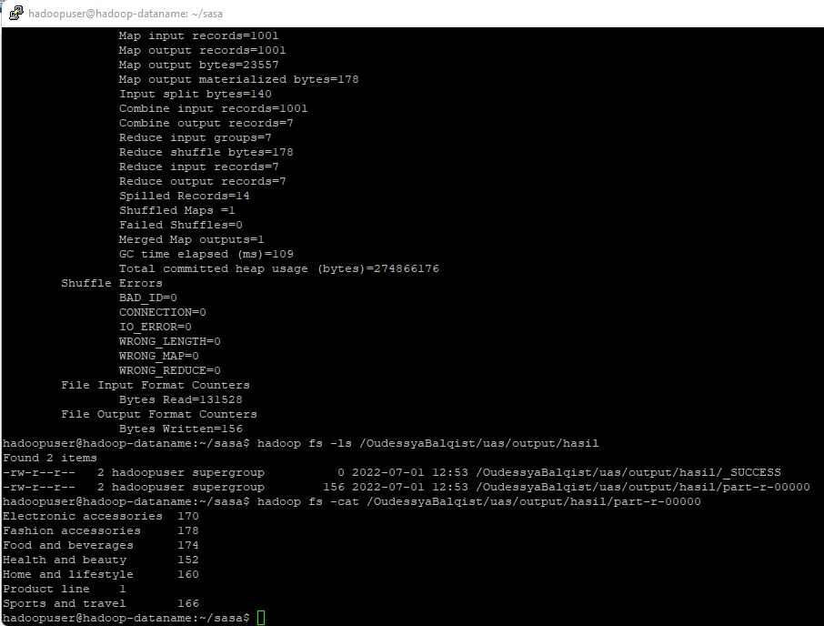

--------------------------
Muhammad Dhiyaul Auliya 
2041723007  
TI - 3G   
--------------------------
### Studi Kasus
Studi Kasus

Perhitungan nilai dari dataset supermarket sales yang diperoleh dari kaggle untuk mengetahui berapa banyak lini produk yang dijual. 

### Hasil Mapreduce Hadoop

### Hasil Presentasi
https://drive.google.com/file/d/1Kl-o8BsSWQAfZATcv205asYSQ_UXww9w/view?usp=sharing
